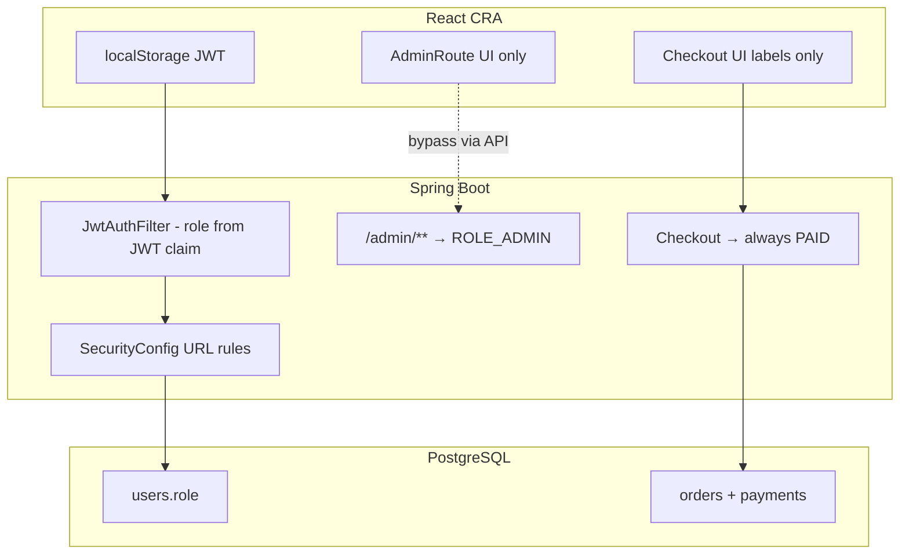
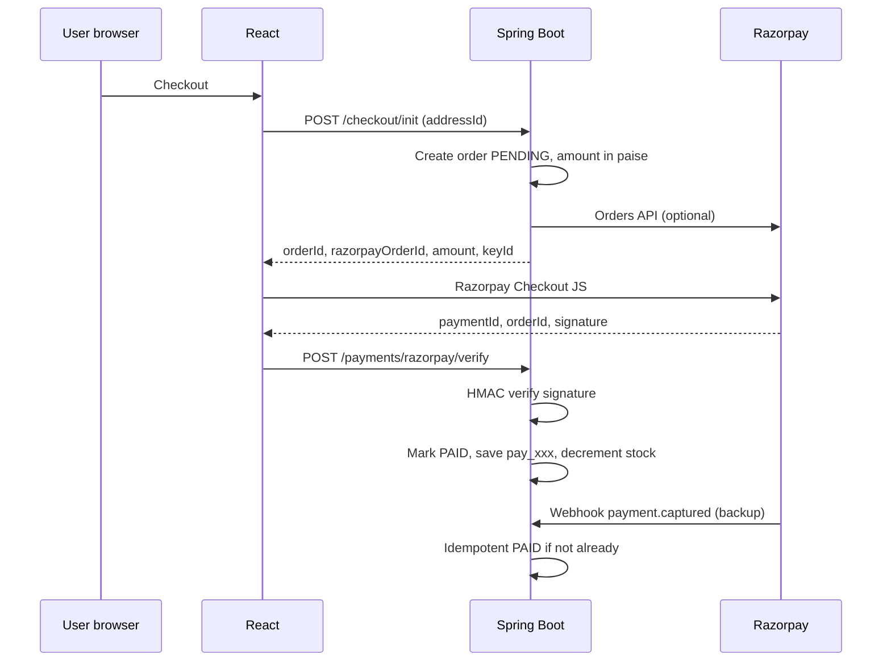

# Uniformly — Security & Production Readiness Report

> **Suggested filename:** `SECURITY_AND_PRODUCTION_READINESS.md` (this file)  
> **Alternative names:** `PRODUCTION_READINESS_AUDIT.md`, `SECURITY_AUDIT.md`, `docs/SECURITY_REPORT.md`  
> **Last updated:** May 2026  
> **Scope:** `backend_java` (Spring Boot) + `frontend_cra` (React)

This document consolidates a security-focused codebase analysis: vulnerabilities, attacker-style access review, API/database security, admin payment field meanings, Razorpay integration plan, and ship-readiness verdict.

---

## Table of contents

1. [Analysis plan](#1-analysis-plan-how-to-audit-this-codebase)
2. [Architecture](#2-architecture-security-relevant)
3. [Attacker perspective](#3-attacker-perspective-admin--customer-access)
4. [Vulnerabilities & drawbacks](#4-vulnerabilities--drawbacks-full-list)
5. [API security](#5-api-security-summary)
6. [Database security](#6-database-security)
7. [Admin dashboard payment columns](#7-admin-dashboard-payment-columns-what-they-mean-today)
8. [Recommendations](#8-recommendations-user-admin-security)
9. [Razorpay integration](#9-razorpay-integration-report-secure-design)
10. [Ship readiness verdict](#10-is-this-ready-to-ship-to-a-client)
11. [Prioritized roadmap](#11-prioritized-action-roadmap)
12. [Live security tests](#12-live-security-tests-run-when-backend-is-up)

---

## 1. Analysis plan (how to audit this codebase)

Use this as a repeatable checklist before any client handoff:

| Phase | What to do | Uniformly focus |
|--------|------------|-----------------|
| **1. Recon** | Map routes, APIs, env vars, migrations | `App.jsx`, `SecurityConfig`, Flyway `V1–V19` |
| **2. AuthN** | Register/login/OAuth/JWT lifecycle | `AuthController`, `JwtService`, `JwtAuthFilter` |
| **3. AuthZ** | Role checks on every sensitive path | `/api/v1/admin/**`, user-scoped repos |
| **4. IDOR** | Access other users’ orders/cart/addresses | `findByIdAndUserId` patterns |
| **5. Business logic** | Checkout, stock, pricing, payment state | `CheckoutController` |
| **6. Input/upload** | File upload, validation, SSRF | `UploadController` vs `AdminProductService` |
| **7. Secrets** | Repo, migrations, defaults, env | `application.yml`, `V19` migration |
| **8. Frontend** | Token storage, route guards, XSS | `AuthContext`, `AdminRoute` |
| **9. Infra** | CORS, TLS, DB credentials, rate limits | `SecurityConfig`, datasource |
| **10. Payment** | Real money flow + webhooks | Currently **mock** — see [Section 9](#9-razorpay-integration-report-secure-design) |

---

## 2. Architecture (security-relevant)



### Key files

| Area | Path |
|------|------|
| Security config | `backend_java/src/main/java/com/uniformly/auth/SecurityConfig.java` |
| JWT | `backend_java/src/main/java/com/uniformly/auth/JwtService.java`, `JwtAuthFilter.java` |
| Auth API | `backend_java/src/main/java/com/uniformly/auth/AuthController.java` |
| Checkout | `backend_java/src/main/java/com/uniformly/checkout/CheckoutController.java` |
| Admin UI guard | `frontend_cra/src/components/AdminRoute.jsx` |
| Auth state | `frontend_cra/src/context/AuthContext.jsx` |
| Config | `backend_java/src/main/resources/application.yml` |

---

## 3. Attacker perspective (admin & customer access)

### 3.1 Access admin dashboard **without** being admin

| Attack | Works? | Why |
|--------|--------|-----|
| Open `/admin` in browser without login | **No** (UI) | `AdminRoute` → `/login` |
| Call `GET /api/v1/admin/dashboard` with no token | **No** (API) | Spring returns 401/403 |
| Call admin API with **customer** JWT | **No** (API) | `hasRole("ADMIN")` on `/api/v1/admin/**` |
| Tamper React state to `role: ADMIN` | **No** for data | APIs still need valid JWT with `ROLE_ADMIN` |
| **Forge JWT** with `role: ADMIN` if `JWT_SECRET` is default/leaked | **Yes** | `JwtAuthFilter` trusts claim; does not re-read DB |
| Password login while DB has `role=ADMIN` for non-allowlisted email | **Yes** | Google path enforces `ADMIN_EMAILS`; **password login does not** |
| Stolen admin JWT after demotion (V19) | **Yes until expiry** | ~24h; role not refreshed from DB |
| Register new account as ADMIN | **No** | New users default `CUSTOMER` |
| Google OAuth with random email | **No** for admin | Only `application.security.admin.emails` gets ADMIN |

**Verdict:** Backend admin APIs are **mostly** protected at the URL layer. Serious gaps: **JWT secret handling**, **stale/forged roles in the token**, and **password login not mirroring Google’s admin allowlist**.

### 3.2 Access **another customer’s** data

| Resource | Protection | Gap |
|----------|------------|-----|
| Orders | `findByIdAndUserId` | Good |
| Cart | `findByIdAndUserId` | Good |
| Addresses | `findByIdAndUserId` | Good |
| Checkout address | Scoped to user | Good |
| Uploaded files `/uploads/{uuid}` | **Public** | Anyone with URL can read |
| Order by guessing order number | Scoped to user | Good |

### 3.3 “Free shopping” / payment bypass (business-critical)

Checkout **never talks to a payment provider**. It always marks the order paid:

```java
// CheckoutController.java — simplified
payments.save(new Payment(saved, request.paymentMethod(), total, "PAID"));
// Order entity also sets payment_status = "PAID" on construction
```

A logged-in user can `POST /checkout` with any `paymentMethod` string and get a **PAID** order. Frontend “Pay ₹…” is cosmetic only.

**Additional business flaws:**

- **No stock decrement** at checkout (`stock_quantity` exists on variants but checkout ignores it).
- **No server-side price verification** beyond current DB price at checkout time.
- **GST hardcoded to zero**; shipping fixed at ₹70.

---

## 4. Vulnerabilities & drawbacks (full list)

### Critical

1. **Default JWT secret in repo** (`application.yml` fallback). If production omits `JWT_SECRET`, anyone can mint admin tokens.
2. **Credentials in Flyway history** — `V19` and older migrations contain admin password hashes and plaintext hints in comments; git history persists unless rotated and scrubbed.
3. **Fake payments** — orders marked `PAID` without money movement (legal, fraud, and client-trust risk).
4. **Seeded admin credentials** — production DB may still use passwords from migrations until changed.

### High

5. **JWT `role` not reconciled with DB** on each request — demoted admins keep access until token expires (~24h).
6. **Password login admin escalation** — DB `ADMIN` + password works without `ADMIN_EMAILS` check (unlike Google login).
7. **No inventory enforcement** — unlimited orders regardless of `stock_quantity`.
8. **Secrets in config defaults** — admin email, Google client ID, JWT default committed in `application.yml`.

### Medium

9. **`/api/upload` authenticated but not admin-only** — any customer can upload; no MIME/size limits (unlike admin product uploads).
10. **`/uploads/**` public** — enumeration is hard (UUID), but link leakage grants file access.
11. **`@PreAuthorize` on `AdminCategoryController` ineffective** — `@EnableMethodSecurity` missing (URL rule still protects).
12. **JWT in `localStorage`** — XSS → token theft.
13. **Logout is client-only** — no server revocation/blacklist.
14. **`/api/v1/auth/**` permitAll** — includes `/me`; unauthenticated misuse can yield poor errors (500 vs 401).
15. **Rate limit** — 5/min per IP, in-memory only; bypass with many IPs; ineffective across multiple app instances without Redis.
16. **Weak password policy** — backend only `@NotBlank` on password; no length/complexity rules.
17. **Profile email change** without verification — account confusion / takeover vectors if combined with OAuth linking quirks.

### Low / hygiene

18. **Admin email hardcoded in frontend** (`AdminRoute.jsx`) — aids reconnaissance; inconsistent with login redirect (role-only → `/admin`).
19. **Footer links to `/admin`** — increases probing.
20. **`allowedHeaders: *` + credentials** — tighten for production.
21. **CSRF disabled** — acceptable for Bearer APIs; not for cookie sessions.
22. **`backend_java/target` in git** — noise and accidental secret leakage.
23. **Checkout contact fields** collected in UI but not sent to API.
24. **Order confirmation page** does not load real order by `orderId` query param.
25. **Categories API requires auth** while products/schools are public — likely accidental UX bug.

### What is done well

- BCrypt for passwords; Google ID token verified server-side.
- Google login strips `ADMIN` from non-allowlisted emails.
- User APIs consistently scoped by `SecurityUtils.getAuthenticatedUserId()`.
- Admin routes gated at `SecurityConfig` level.
- Admin product image upload: MIME allowlist, safe paths.
- CORS allowlist (not `*`), HSTS, frame deny, CSP on API responses.
- JPA/Flyway — parameterized queries; low SQL injection risk in normal paths.

---

## 5. API security summary

| Endpoint group | Auth | Risk |
|----------------|------|------|
| `/api/v1/auth/*` | Mostly public | Brute force partially mitigated; no MFA |
| `/api/v1/products`, `/schools` | Public | OK for catalog |
| `/api/v1/cart`, `/orders`, `/checkout`, `/addresses` | Authenticated | IDOR well handled |
| `/api/v1/admin/**` | `ROLE_ADMIN` | Depends on JWT integrity |
| `/api/upload` | Any logged-in user | Abuse / malware hosting |
| `/uploads/**` | Public | Leaked URLs |

**Missing for production APIs:** request ID logging, structured audit log for admin actions, webhook signature verification (payments), idempotency keys on checkout, global 401 handler on frontend.

### SecurityConfig rules (reference)

- `permitAll`: `/api/v1/auth/**`, products, schools, `/uploads/**`, `/error/**`
- `authenticated`: `/api/upload`, all other non-admin routes
- `hasRole("ADMIN")`: `/api/v1/admin/**`

---

## 6. Database security

| Area | Status | Notes |
|------|--------|-------|
| Credentials | Env-based | Empty default password in YAML — use strong DB password in prod |
| Migrations | **Risk** | Passwords/hashes/comments in SQL files (`V8`, `V16`, `V17`, `V19`) |
| Schema | Reasonable | FKs on orders; `payments.provider_payment_id` ready for Razorpay |
| Least privilege | Ops | App DB user should not be superuser |
| Encryption at rest | Infra | Depends on host (Neon/RDS/etc.) |
| Backups | Ops | Not in repo — must be configured |
| PII | Present | Names, emails, phones, addresses; admin CSV export |

**Recommendation:** Rotate admin password immediately; never put passwords in new migrations; use one-time bootstrap outside git.

---

## 7. Admin dashboard payment columns (what they mean today)

You do **not** configure Razorpay keys in the admin payment column. Today those fields are **read-only order metadata**:

| Admin field | Source | Meaning today |
|-------------|--------|----------------|
| **Payment Method** | Customer-selected label at checkout (`UPI`, `COD`, etc.) | **Not** a gateway config — just a string on the order |
| **Payment Status** | Set in code to `PAID` on every checkout | Misleading until a real gateway exists |
| **Payments table** | `provider` = payment method string; `provider_payment_id` often empty | Intended for Razorpay `pay_xxx` later |

### What to show in admin **after** Razorpay (display only)

| Column | Example values |
|--------|----------------|
| Payment Method | `razorpay`, `card`, `upi`, `cod` |
| Payment Status | `pending`, `paid`, `failed`, `refunded` |
| Provider Payment ID | `pay_...` (support/refunds) |
| Actions | “Confirm COD”, link to Razorpay Dashboard |

### What must **never** go in admin UI

- `RAZORPAY_KEY_SECRET`
- Webhook secret
- Any API keys — **server environment variables only**

---

## 8. Recommendations (user, admin, security)

### Security (before client ship)

1. Set strong random `JWT_SECRET` (32+ bytes); remove default from YAML; rotate all sessions.
2. Change admin password; remove password hints from migrations; use secure bootstrap only.
3. On admin (or all) requests: reconcile JWT `role` with `users.role` in DB, or use short-lived tokens + refresh.
4. Apply `ADMIN_EMAILS` check on **password login** (same as Google login).
5. Enable `@EnableMethodSecurity` + `@PreAuthorize` on all admin controllers.
6. Restrict `/api/upload` to `ADMIN` or remove; add size/MIME limits; prefer private storage with signed URLs.
7. Implement real payments before accepting money ([Section 9](#9-razorpay-integration-report-secure-design)).
8. Decrement stock in checkout transaction; reject if insufficient.
9. Prefer **httpOnly Secure SameSite** cookies or BFF; strict CSP + XSS hygiene on CRA.
10. Add Redis rate limiting; log admin mutations; 401 interceptor on frontend.
11. Remove hardcoded admin email from frontend; enforce policy on server only.
12. Add `backend_java/target/` to `.gitignore`; remove from git history if committed.

### User experience

- Show real order on confirmation page (`orderId` query).
- Sync checkout contact info with address/order.
- Clear copy: “You will be redirected to Razorpay to pay” once integrated.
- Fix categories visibility if size guides should work without login.
- Global loading/error states for expired sessions.

### Admin experience

- Payment filters: Pending / Paid / Failed / COD awaiting confirmation.
- Manual “Mark COD received” (ADMIN only).
- Refund status field (manual at first).
- Audit trail: who changed order status and when.
- Remove or hide public footer link to `/admin`.

---

## 9. Razorpay integration report (secure design)

### 9.1 Principles

- **Never** trust frontend payment success alone.
- **Amount and order id** are created on the **server**.
- **Mark PAID** only after **signature verification** (callback) or **webhook** with idempotency.
- **Key secret** only on backend; frontend gets **Key ID** only.

### 9.2 Recommended flow



### 9.3 Backend changes (outline)

| Step | Action |
|------|--------|
| 1 | Env: `RAZORPAY_KEY_ID`, `RAZORPAY_KEY_SECRET`, `RAZORPAY_WEBHOOK_SECRET` |
| 2 | Change default `payment_status` to `PENDING` until verified |
| 3 | `PaymentService`: create Razorpay order (amount in **paise**, INR) |
| 4 | `POST /api/v1/checkout/init` → Razorpay order id; **do not** mark PAID |
| 5 | `POST /api/v1/payments/razorpay/verify` — verify signature via official SDK |
| 6 | `POST /api/v1/webhooks/razorpay` — raw body + `X-Razorpay-Signature`; signature required |
| 7 | Store `provider_payment_id`, `provider='razorpay'` |
| 8 | COD: `PENDING` until admin confirms → PAID |
| 9 | Unique constraint on `provider_payment_id` for idempotency |

### 9.4 Frontend changes

- Load Razorpay checkout script on checkout page only.
- Replace fake “Pay” with: init → modal → verify endpoint → confirmation.
- On failure/close: show retry; order stays `PENDING`.

### 9.5 Admin dashboard after Razorpay

| Column | Values |
|--------|--------|
| Payment Method | `razorpay`, `cod` |
| Payment Status | `pending`, `paid`, `failed`, `refunded` |
| Razorpay Payment ID | `pay_...` |
| Actions | Confirm COD, View in Razorpay |

### 9.6 Razorpay security checklist

- [ ] Webhook secret in env; reject unsigned webhooks
- [ ] Verify amount matches server order (prevent amount tampering)
- [ ] Use Razorpay **Orders API** so amount is bound to `order_id`
- [ ] Rate-limit verify endpoint
- [ ] Log payment events; no card data on your server (minimal PCI scope)
- [ ] Separate test vs live keys per environment
- [ ] Refunds via Razorpay Dashboard/API with admin audit

### 9.7 Effort estimate

| Area | Rough effort |
|------|----------------|
| Backend payment + webhook | 2–4 days |
| Frontend checkout | 1–2 days |
| Admin UI + COD flow | 1 day |
| Testing (success/fail/webhook replay) | 1–2 days |

---

## 10. Is this ready to ship to a client?

### Verdict: **Not ready** for production e-commerce that accepts real payments or holds customer data at scale without further work.

| Criterion | Ready? |
|-----------|--------|
| Catalog browsing | **Mostly yes** |
| User accounts / cart / orders UI | **Mostly yes** |
| Admin catalog & orders | **Mostly yes** (after secret rotation) |
| **Real payments** | **No** — implement Razorpay (or similar) |
| **Security hardening** | **No** — JWT defaults, migration secrets, payment bypass |
| **Inventory / fulfillment** | **Partial** — stock not enforced on sale |
| Legal/compliance (GST invoices, refunds) | **Not assessed in code** |

**Reasonable for:** Internal demo, school pilot with **manual payment / COD only** and clear “beta” disclaimer — **after** rotating `JWT_SECRET` and admin password.

**Production client ship:** Complete Section 8 P0/P1 items + Section 9 + stock enforcement + security retest.

---

## 11. Prioritized action roadmap

| Priority | Task |
|----------|------|
| **P0** | Rotate `JWT_SECRET`, admin password; remove secrets from migrations/comments |
| **P0** | Stop marking orders PAID without gateway (or disable checkout in prod) |
| **P1** | Razorpay init + verify + webhook |
| **P1** | Stock check + decrement on paid order |
| **P1** | DB role check on admin routes |
| **P2** | Upload hardening, token storage, admin email server-only |
| **P2** | Order confirmation + checkout field fixes |
| **P3** | Audit logs, Redis rate limit, E2E security tests |

---

## 12. Live security tests (run when backend is up)

```bash
# No token → admin must fail (expect 401/403)
curl -i http://localhost:8080/api/v1/admin/dashboard

# Customer JWT → admin must fail
curl -i -H "Authorization: Bearer <customer_token>" \
  http://localhost:8080/api/v1/admin/orders

# Checkout marks PAID without real payment (document behavior)
curl -i -X POST http://localhost:8080/api/v1/checkout \
  -H "Authorization: Bearer <customer_token>" \
  -H "Content-Type: application/json" \
  -d '{"addressId":1,"paymentMethod":"UPI"}'
```

**JWT forgery test (staging only):** If `JWT_SECRET` matches the default in `application.yml`, an attacker can sign a token with `role: ADMIN` — confirm production uses a unique secret.

---

## Document history

| Version | Notes |
|---------|--------|
| 1.0 | Initial security & readiness audit |

---

*For implementation of Razorpay or security fixes, track work against Section 11 priorities.*
